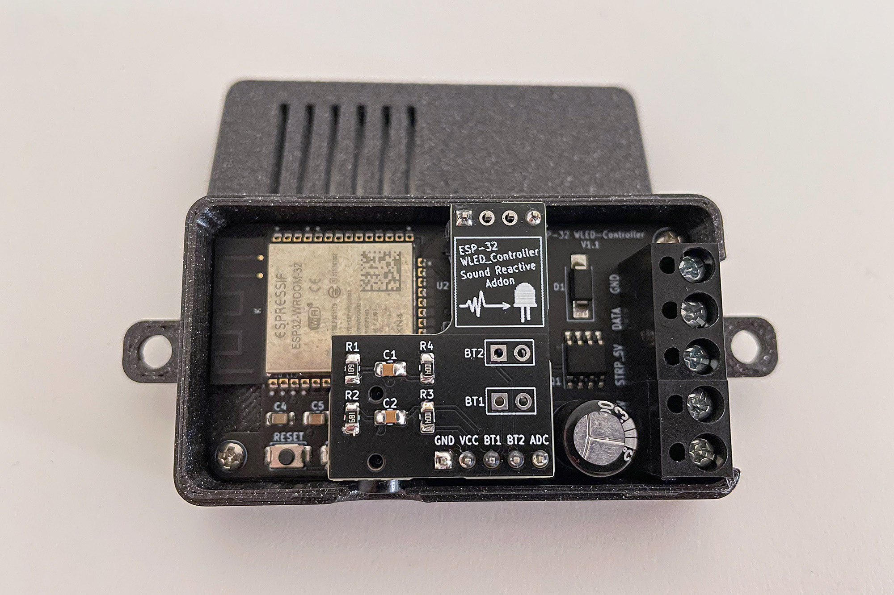
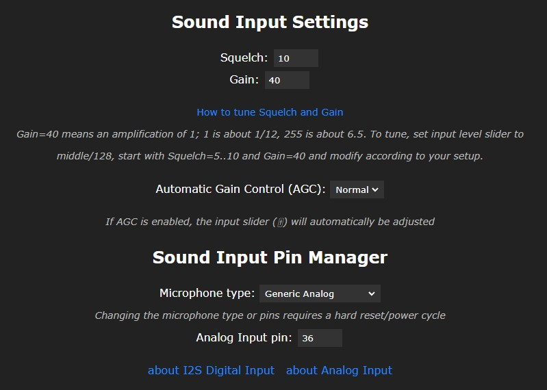
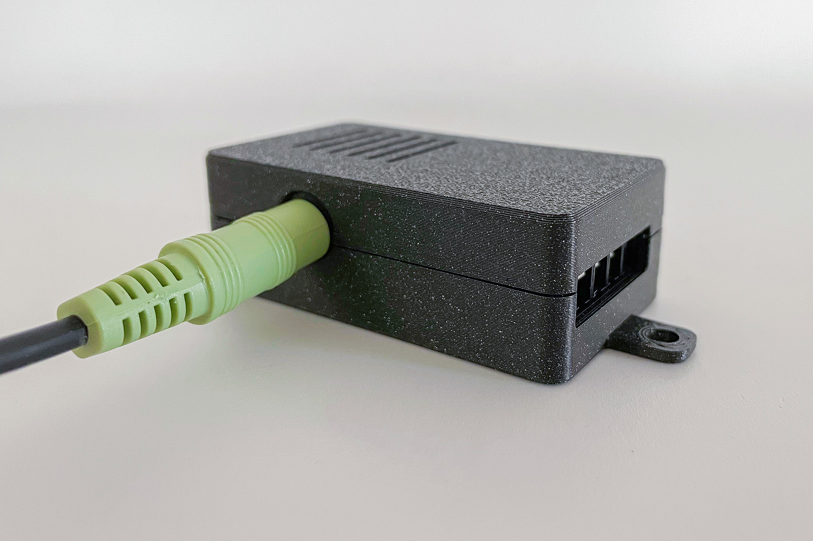

# ESP-32_WLED-Controller_addon  

[deutsche Version unten ->](#Deutsch)

This addon board allows you to expand the ESP-32_WLED-Controller with the Sound Reactive feature https://github.com/atuline/WLED. The board is practically stacked on top of the controller using 2.54mm pin and socket headers.

## Settings

WLED Sound Reactive comes with an additional configuration menu.
For Squelch and Gain, you'll need to configure your own settings.
Microphone type is **Generic Analog**.
The Analog Input Pin is on `GPIO36`.

## Case

There is also a simple case available for connecting the 3.5mm audio jack.
The STEP file for further modifications is also located in the "case" folder.

## BOM

| Refs | Qty | Component | Description |
| --- | --- | --- | ----------- |
| R1, R2 | 2 | 680R | Resistor 0805  |
| R3, R4 | 2 | 1M | Resistor 0805  |
| C1, C2 | 2 | 100nF | Capacitor 0805  |
| J3 | 1 | Audio Jack 3.5mm | PJ230D https://de.aliexpress.com/item/4000661908135.html |
| J1 | 1 | PinHeader_1x05_P2.54mm_Vertical |
| J5 | 1 | PinHeader_1x04_P2.54mm_Vertical |

## Gerber Data

You can find the manufacturing data for the board in the “gerber” folder.
In addition, there is also the BOM and CPL data for SMT production. However, the assembly is two-sided, as the jack socket is mounted on the bottom for space reasons.
The jack socket is called PJ230D. I found these cheaply at https://de.aliexpress.com/item/4000661908135.html.

---
## Deutsch

Mit dieser Addon-Platine lässt sich der ESP-32_WLED-Controller um das Sound Reactive Feature erweitern https://github.com/atuline/WLED. Die Platine wird praktisch im "Huckepack" auf den Controller gesteckt.
Dazu lassen sich 2.54mm Stift- und Buchsenleisten verwenden.

## Einstellungen

WLED Soundreactive hat ein weiteres Konfigurationsmenü.
Für Squelch und Gain muss man seine eigenen Einstellungen fingen.
Micropone type ist **Generic Analog**.  
Der Analog Input Pin liegt auf `GPIO36`.

## Gehäuse

Es gibt auch ein einfaches Gehäuse, damit man den 3,5mm Klinkenstecker anschließen kann.
Die STEP-Datei für weitere Modifikationen befindet sich auch in dem Ordner "case" 

## BOM

| Refs | Qty | Component | Description |
| --- | --- | --- | ----------- |
| R1, R2 | 2 | 680R | Resistor 0805  |
| R3, R4 | 2 | 1M | Resistor 0805  |
| C1, C2 | 2 | 100nF | Capacitor 0805  |
| J3 | 1 | Audio Jack 3.5mm | PJ230D https://de.aliexpress.com/item/4000661908135.html |
| J1 | 1 | PinHeader_1x05_P2.54mm_Vertical |
| J5 | 1 | PinHeader_1x04_P2.54mm_Vertical |

## Gerberdaten

Die Fertigungsdaten zur Platine findest du im Ordner "gerber". 
Zusätzlich gibt es dort auch die BOM und CPL Daten für die SMT-Fetigung. Die Bestückung ist allerdings zweiseitig, da aus Platzgründen die Klinkenbuchse auf der Unterseite montiert wird.
Die Klinkenbuchse heißt PJ230D. Diese habe ich günstig unter https://de.aliexpress.com/item/4000661908135.html gefunden.