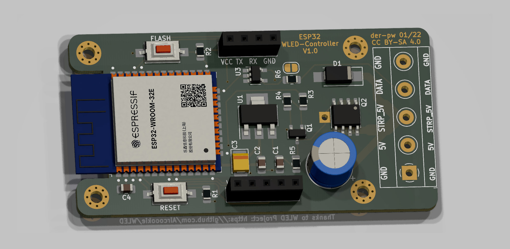
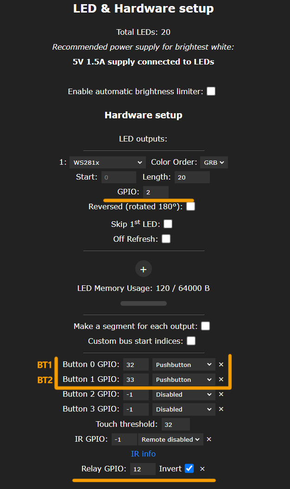
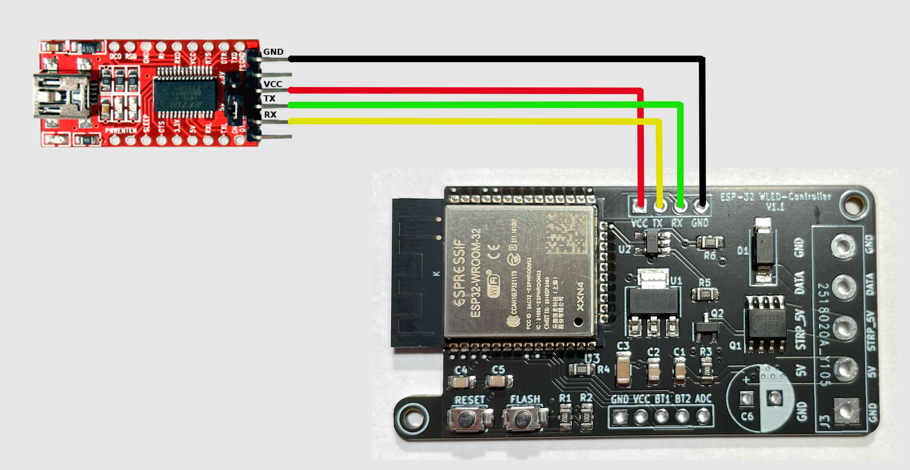
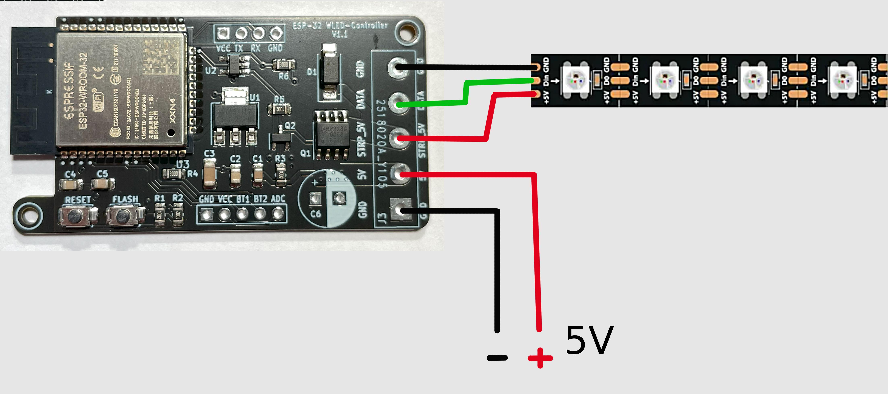

# ESP-32_WLED-Controller  

Weiterentwicklung meines [ESP-12-WLED_Controllers](https://github.com/der-pw/ESP-12_WLED-Controller).  
Diese Version, mit ESP32, ermöglicht bswp. [Sound Reactive Features](https://github.com/atuline/WLED/wiki) mit wesentlich besserer Performance als es mit einem ESP2866 möglich ist. Die Platinengröße ist nur minimal gewachsen, der Controller lässt sich nach wie vor in kleinen Projekten unterbringen. Weiterhin wird die Versorgungsspannug des LED-Strips über einen P-MOSFET schaltbar gemacht um somit den Ruhestrom zu begrenzen. 16A Schaltlast sind möglich!  

## Einstellungen
  

## Firmware flashen
  

FTDI oder anderen passenden UART-Wandler gemäß Anschlussplan verbinden.
Entweder mit gedrücktem FLASH Button verbinden oder wenn der Controller bereits über ein Netzteil versorgt wirden, FLASH gedrückt halten, RESET kurz drücken und danach kann FLASH losgelassen werden.  

Möglicherweise wird der ESP32 vom FTDI unterversorgt und die Brownout Detection reagiert. Daher ist es ratsam, den Controller bereits mit einer externen 5V Spannungsquelle zu versorgen.  

Dieser Controller kann mit einem [fertigen Binary](https://install.wled.me/) verwendet werden.

## Strip und Versorgungsspannung
  
LED Strip und Netzteil werden gemäß Anschlussplan verbunden.

## Teileliste

Anzahl | Beschreibung | Info
-------- | -------- | --------
1   | CTB1202-5BK   | [Lötbare Schraubklemme - 5-pol, RM 5 mm](https://www.reichelt.de/loetbare-schraubklemme-5-pol-rm-5-mm-90--ctb1202-5bk-p292662.html)
1   | NHG-A 1,0M 6,3   | [Elko, radial, 1.000µF, 6,3V, RM3,5](https://www.reichelt.de/elko-radial-1-000-f-6-3v-rm3-5-1000h-105-c-20--nhg-a-1-0m-6-3-p200391.html)

## Dankeschön!  

Ein besonderer Dank geht an [Aircoookie](https://github.com/Aircoookie) und allen Beteiligten, die am [WLED](https://github.com/Aircoookie/WLED) Projekt mitarbeiten.
Gerber- und Fertigungsdaten wurden mit [kicad-jlcpcb-tools
](https://github.com/Bouni/kicad-jlcpcb-tools) erstellt.  

