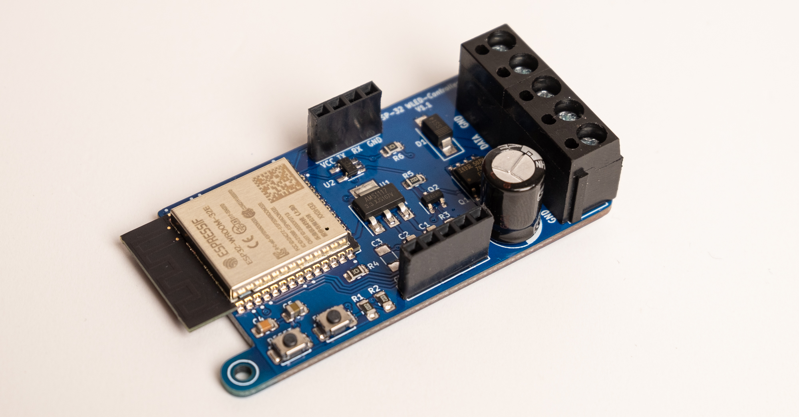
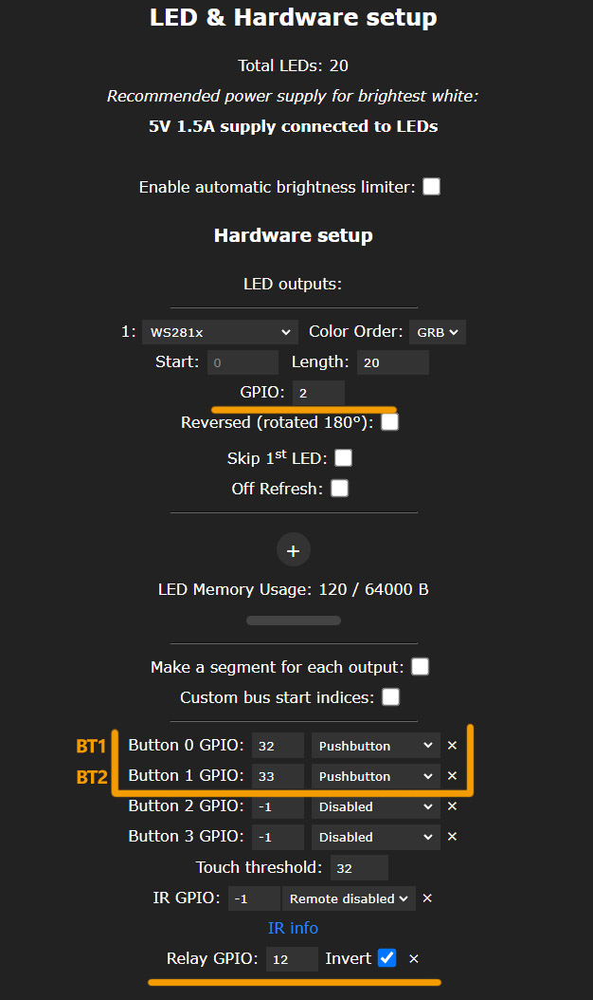
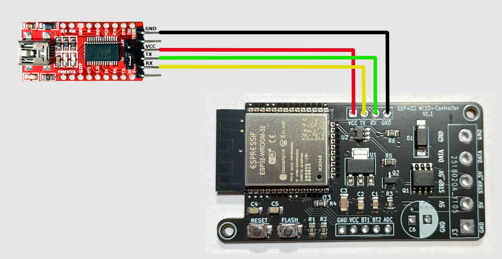
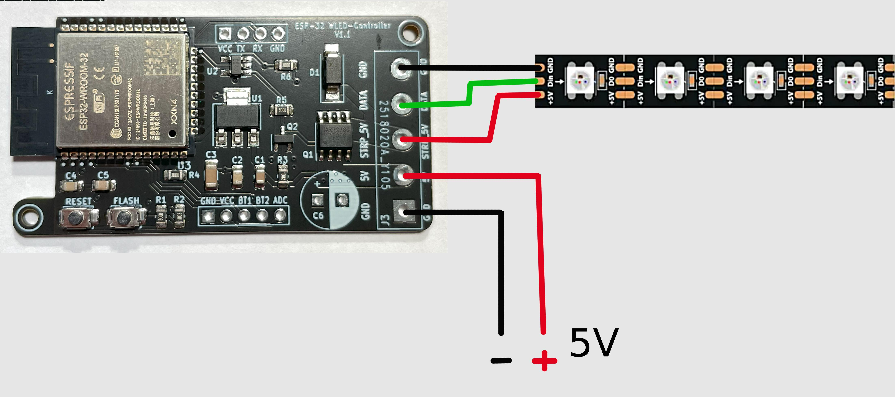
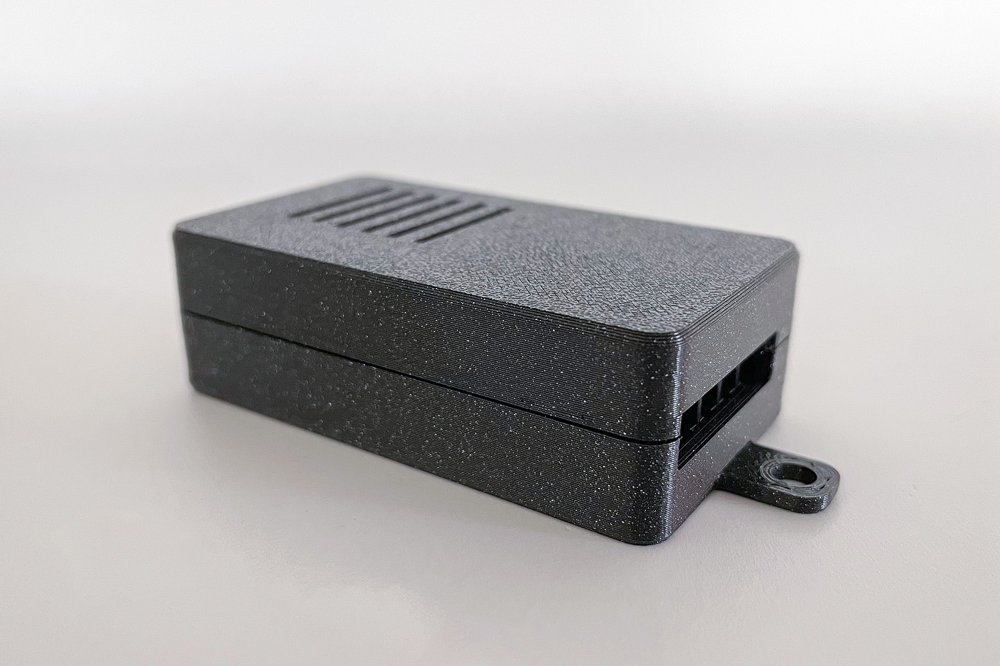

# ESP-32_WLED-Controller  

[deutsche Version unten ->](#Deutsch)

This is like an evolution of my [ESP-12-WLED_Controller](https://github.com/der-pw/ESP-12_WLED-Controller). It based on my ESP-12 Controller, so you can find also all the necessary information about MOSFETs, etc. there as well.

The version with ESP32 is more powerful and enables features like Sound Reactive https://github.com/atuline/WLED with significantly better performance than the ESP2866. Also you can find here the [Sound Reactive Addon](ESP-32_WLED-Controller_Addon) for this controller. The PCB size has just slightly increased, and the controller can still fit into small projects. To have a clean design and ensure the LED strip works with a 5V data level, I used a 74LVC1G125 as a Logic Level Shifter.

Additionally, the power supply for the LED strip can be turned off by using a P-channel MOSFET. Even when turned off, NEOPIXEL strips consume some power (approximately 1mA per pixel). Luckily, WLED provides an option to control a "Relay" through a user-defined pin. Additional to the P-MOSFET, there is another N-MOSFET. It works as a driver to switch the P-MOSFET with a 5V logic level and also as an inverter, allowing the main MOSFET to logical "active HIGH" at GPIO12 of the ESP.

## Settings
The configuration for inputs and outputs is as follows:

Label | GPIO | Remarks
--- | --- | ---
Data Pin | `GPIO 2`  
Relay Pin | `GPIO12` | **invert**  
*optional:*  
Button 0 | `GPIO32`  
Button 1 | `GPIO33`  
ADC | `GPIO36` | Analog Input

## Flashing the Firmware

Connect an FTDI or another compatible UART converter like showing the wiring diagram. Either connect with the FLASH button pressed or, if the controller is already powered by a power supply, hold FLASH, press RESET briefly, and then release FLASH. Now controller is in bootloader mode.

The ESP32 may be underpowered by the FTDI, causing the Brownout Detection is triggered. Therefore, you need to power the controller with an external 5V voltage source.

This controller can be used with a [pre-made binary](https://install.wled.me/).

## Strip and Power Supply

Connect the LED strip and power supply as per the wiring diagram.

## Parts List
Includes parts that need to be soldered by hand.

Quantity | Description | Info
-------- | -------- | --------
1   | CTB1202-5BK   | [Solderable Screw Terminal - 5-pin, Pitch 5 mm](https://www.reichelt.de/loetbare-schraubklemme-5-pol-rm-5-mm-90--ctb1202-5bk-p292662.html)
1   | NHG-A 1.0M 6.3   | [Capacitor, radial, 1000µF, 6.3V, Pitch 3.5mm](https://www.reichelt.de/elko-radial-1-000-f-6-3v-rm3-5-1000h-105-c-20--nhg-a-1-0m-6-3-p200391.html)

## Case
  

There is also a simple case available. Both parts can be connected with a click fastener. The STEP file for modifications to the case is included in the project folder.

## Gerbers
You can find the necessary fabrication data in the “gerber” folder. This also includes the BOM and CPL files. I have had good experiences with JLCPCB, and production there ran smoothly with the data. However, some parts may not always be available.

## Thank You!

A special thanks to [Aircoookie](https://github.com/Aircoookie) and all those involved in the [WLED](https://github.com/Aircoookie/WLED) project!  
Gerber and fabrication data were created using the [Fabrication Toolkit](https://github.com/bennymeg/JLC-Plugin-for-KiCad).

---
## Deutsch

Dies ist die Weiterentwicklung meines [ESP-12-WLED_Controllers](https://github.com/der-pw/ESP-12_WLED-Controller). Daher kannst du alle nötigen Infos über MOSFET etc. auch dort finden.  
Die Version mit ESP32 ist leistungfähiger und ermöglicht bswp. Sound Reactive Features https://github.com/atuline/WLED. Dafür findes du auch hier ein [Sound Reactive Addon](ESP-32_WLED-Controller_Addon), welches einfach auf den Controller gesteckt werden kann. Die Platinengröße ist nur minimal gewachsen, der Controller lässt sich nach wie vor in kleinen Projekten unterbringen. Für ein sauberes Design und damit der LED-Strip mit einem 5V Datenpegel arbeitet verwende ich einen 74LVC1G125 als Logic Level Shifter.  
Zusätzlich kann die Versorgungsspannung für den LED-Strip über einen P-Kanal MOSFET abgeschaltet werden. Auch im ausgeschalteten Zustand verbrauchen die NEOPIXEL-Strips nämlich Strom (ca. 1mA/Pixel).
Praktischerweise bietet WLED hier die Möglichkeit über einen frei definierten Pin ein "Relay" zu schalten. Vor dem P-MOSFET sitzt ein weiterer N-MOSFET. Einmal funktioniert dieser als Treiber um den P-MOSFET mit 5V Logikpegel zu schalten und zum anderen als Inverter, damit der Haupt-MOSFET praktisch "active HIGH" am GPIO12 des ESP durchschaltet. 

## Einstellungen
Die Konfiguration für Ein-/ und Ausgänge erfolgt wie abgebildet.  

Bezeichnung | GPIO | Bemerkung
--- | --- | ---
Data Pin | `GPIO 2`  
Relay Pin | `GPIO12` | **invert**  
*optional:*  
Button 0 | `GPIO32`  
Button 1 | `GPIO33`  
ADC | `GPIO36` | Analog Eingang

  

## Firmware flashen
  

FTDI oder anderen passenden UART-Wandler gemäß Anschlussplan verbinden.
Entweder mit gedrücktem FLASH Button verbinden oder wenn der Controller bereits über ein Netzteil versorgt wirden, FLASH gedrückt halten, RESET kurz drücken und danach kann FLASH losgelassen werden.  

Möglicherweise wird der ESP32 vom FTDI unterversorgt und die Brownout Detection reagiert. Daher ist es ratsam, den Controller bereits mit einer externen 5V Spannungsquelle zu versorgen.  

Dieser Controller kann mit einem [fertigen Binary](https://install.wled.me/) verwendet werden.

## Strip und Versorgungsspannung
  
LED Strip und Netzteil werden gemäß Anschlussplan verbunden.

## Teileliste
Beinhaltet Teile, die von Hand eingelötet werden müssen.
Anzahl | Beschreibung | Info
-------- | -------- | --------
1   | CTB1202-5BK   | [Lötbare Schraubklemme - 5-pol, RM 5 mm](https://www.reichelt.de/loetbare-schraubklemme-5-pol-rm-5-mm-90--ctb1202-5bk-p292662.html)
1   | NHG-A 1,0M 6,3   | [Elko, radial, 1.000µF, 6,3V, RM3,5](https://www.reichelt.de/elko-radial-1-000-f-6-3v-rm3-5-1000h-105-c-20--nhg-a-1-0m-6-3-p200391.html)

## Gehäuse
  

Ein einfaches Gehäuse gibt es auch.
Beide Teile können über einen Klickverschluss miteinander verbunden werden.
Für Änderungen am Gehäuse liegt im Projektorder die STEP-Datei.  

## Gerberdaten
Du kann die nötigen Fertigungsdaten im Ordner "gerber" finden. Darin enthalten sind auch die BOM und CPL Files. Mit JLCPCB habe ich guter Erfahrungen gemacht, und mit den Daten lief die Fertigung dort auch problemlos. Es ist jedoch möglich, das manche Teile vielleicht nicht immer verfügbar sind.

## Dankeschön!  
Ganz besonderer Dank geht an [Aircoookie](https://github.com/Aircoookie) und allen Beteiligten, die am [WLED](https://github.com/Aircoookie/WLED) Projekt mitarbeiten!  
Gerber und Fertigungsdaten wurden mit [Fabrication Toolkit](https://github.com/bennymeg/JLC-Plugin-for-KiCad) erstellt!

